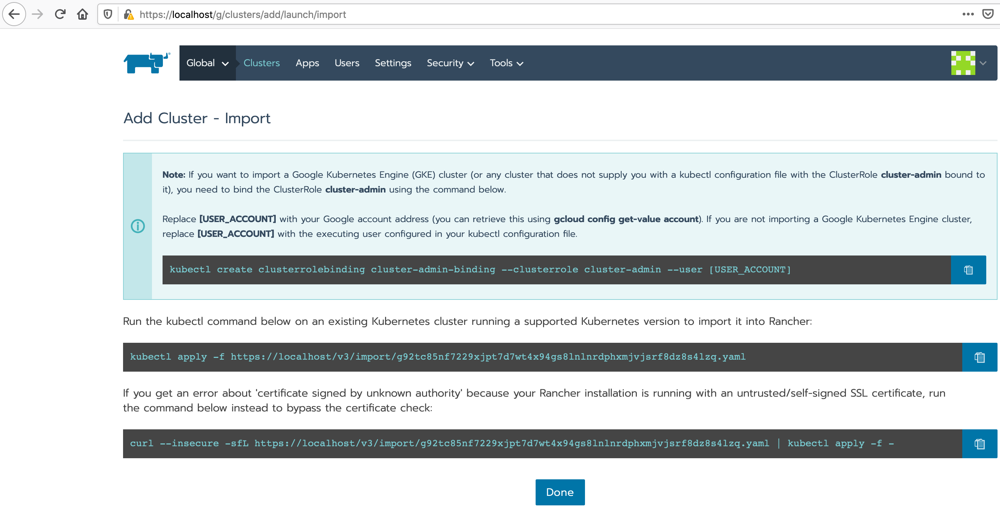

# K3s introduction

## Pre-requisites

- Linux operating system system or OS/x
- VirtualBox
- vagrant
- git
- docker (on the host system only)

## Provision the virtual machines (VMs) for the k3s cluster

`vagrant up --provision` will take about 15 minutes to complete.

The full output is available as a [gist](https://gist.github.com/gdha/5bb1ff685f7c927c2fad5dd04f6a0c9d)

## Start an Ubuntu pod
````
kubectl run -i --tty ubuntu --image=ubuntu:16.04 --restart=Never -- bash -il
````

# Play with Rancher Administration suite (optional)

## Start the Rancher Server with docker (outside the k3s cluster)

````
docker run -d --restart=unless-stopped \
-p 80:80 -p 443:443 \
rancher/rancher:latest
````

Login via https://localhost/ as admin

## Import the k3s cluster

<p align="center"></p>
<br>
<p align="center"></p>

## Launch the Rancher cattles (via k3s-master)

````
root@k3s-master:~# curl --insecure -sfL https://rancher/v3/import/g92tc85nf7229xjpt7d7wt4x94gs8lnlnrdphxmjvjsrf8dz8s4lzq.yaml | kubectl apply -f -
clusterrole.rbac.authorization.k8s.io/proxy-clusterrole-kubeapiserver created
clusterrolebinding.rbac.authorization.k8s.io/proxy-role-binding-kubernetes-master created
namespace/cattle-system created
serviceaccount/cattle created
clusterrolebinding.rbac.authorization.k8s.io/cattle-admin-binding created
secret/cattle-credentials-6c706fa created
clusterrole.rbac.authorization.k8s.io/cattle-admin created
deployment.apps/cattle-cluster-agent created
daemonset.apps/cattle-node-agent created
root@k3s-master:~# kubectl get pods -A
NAMESPACE       NAME                                      READY   STATUS              RESTARTS   AGE
kube-system     metrics-server-6d684c7b5-vxxsd            1/1     Running             0          17m
kube-system     local-path-provisioner-58fb86bdfd-g5x7t   1/1     Running             0          17m
kube-system     tiller-deploy-6966cf57d8-zjcbb            1/1     Running             0          17m
kube-system     coredns-d798c9dd-ltg9j                    1/1     Running             0          17m
kube-system     helm-install-traefik-mw2bq                0/1     Completed           0          17m
kube-system     svclb-traefik-xsrgh                       3/3     Running             0          16m
kube-system     traefik-65bccdc4bd-sdngd                  1/1     Running             0          16m
kube-system     svclb-traefik-lt9q2                       3/3     Running             0          12m
kube-system     svclb-traefik-djbwk                       3/3     Running             0          8m36s
cattle-system   cattle-cluster-agent-787f54bfd5-df699     0/1     ContainerCreating   0          25s
cattle-system   cattle-node-agent-pnbj9                   0/1     ContainerCreating   0          25s
cattle-system   cattle-node-agent-zqvj9                   0/1     ContainerCreating   0          25s
cattle-system   cattle-node-agent-cnv2z                   0/1     ContainerCreating   0          25s
````
